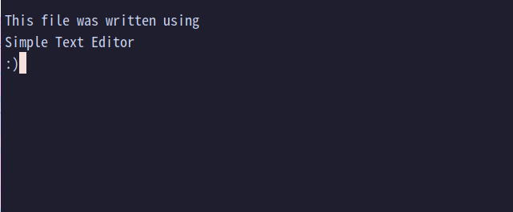

# Simple Text Editor

A [Simple Text Editor](https://github.com/jibrilfdev/simple-text-editor) written in C++.


## Build Dependencies
g++ <br />
ncurses library

## Installation

Clone the repository locally.

```bash
git clone https://github.com/jibrilfdev/simple-text-editor.git
cd simple-text-editor
g++ src/main.cpp -o simple -l ncurses
```

## Usage

```bash
./simple FILENAME
```

Run the program with an argument of the file name to edit that file. Run the program with no arguments to go to the title screen first where a file name can then be entered.



## Contributing

Pull requests are welcome. Issues are welcome, and will potentially be addressed.

## License

[MIT](https://choosealicense.com/licenses/mit/)
